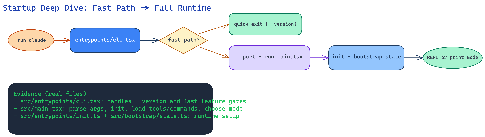

# Startup & Bootstrap Deep Dive

This page explains how Claude Code starts up, in simple terms.

---

## Fundamental idea

Startup is designed in **two phases**:

1. **Fast gate**: do quick checks and avoid loading everything.
2. **Full runtime init**: load config, state, tools, integrations, and UI/headless mode.

This keeps startup fast while still supporting advanced features.

---

## Component diagram (deeper view)

---

## Step-by-step walkthrough

### Step 1: Thin CLI bootstrap

`src/entrypoints/cli.tsx` runs first.

What it does:
- checks special fast-path flags (like `--version`),
- handles a few feature-specific paths,
- then lazily imports full app startup.

Why this matters:
- cheap commands do not pay full startup cost.

### Step 2: Main orchestrator

`src/main.tsx` is the control center.

What it decides:
- interactive vs non-interactive mode,
- model and runtime settings,
- initialization ordering,
- whether to launch REPL UI or print/headless path.

### Step 3: Init + global state

`src/entrypoints/init.ts` and `src/bootstrap/state.ts` prepare runtime context:
- config and environment safety,
- session and process-level state,
- telemetry/analytics setup points,
- policy and integration readiness.

### Step 4: Launch runtime mode

From there:
- interactive mode goes to REPL + Ink rendering,
- non-interactive mode goes through print/headless execution.

---

## Mental model

Think of startup like airport flow:

- **Security gate** (`cli.tsx`): quick checks first.
- **Control tower** (`main.tsx`): route all flights.
- **Ground systems** (`init.ts` + `bootstrap/state.ts`): power up everything safely.
- **Boarding gate** (REPL or print mode): enter the correct execution path.

---

## Key source files

- `src/entrypoints/cli.tsx`
- `src/main.tsx`
- `src/entrypoints/init.ts`
- `src/bootstrap/state.ts`
- `src/replLauncher.tsx`
- `src/cli/print.ts`
