# Startup & Bootstrap Deep Dive

> **[Back to Learning Path](./README.md)** | **[Back to Overview](./CLAUDE_CODE_ARCHITECTURE_EASY.md)** | **Next:** [Query Lifecycle](./02-query-lifecycle-deep-dive.md)

This page explains how Claude Code starts up -- from typing `claude` to being ready for your first prompt.

---

## Table of contents

- [The fundamental idea](#the-fundamental-idea)
- [Visual diagram](#visual-diagram)
- [Step 1: Thin CLI bootstrap](#step-1-thin-cli-bootstrap)
- [Step 2: Main orchestrator](#step-2-main-orchestrator)
- [Step 3: Init and global state](#step-3-init-and-global-state)
- [Step 4: Launch runtime mode](#step-4-launch-runtime-mode)
- [What actually happens in parallel](#what-actually-happens-in-parallel)
- [Mental model](#mental-model)
- [Key source files](#key-source-files)

---

## The fundamental idea

Startup is designed in **two phases**:

| Phase | Purpose | Speed |
|-------|---------|-------|
| **Fast gate** | Handle cheap commands (`--version`) without loading anything heavy | ~50ms |
| **Full runtime** | Load config, state, tools, integrations, and launch UI or headless mode | ~500ms |

This means: if you only need `claude --version`, you get an answer in milliseconds.
If you start a full session, everything loads in parallel for maximum speed.

---

## Visual diagram

This diagram shows the startup flow from process start to runtime mode selection:

<p align="center">
  
</p>

> Open the [Excalidraw source](./startup-bootstrap-deep-dive.excalidraw) in [excalidraw.com](https://excalidraw.com) to explore interactively.

---

## Step 1: Thin CLI bootstrap

**File:** [`src/entrypoints/cli.tsx`](../../src/entrypoints/cli.tsx)

This is the very first code that runs when you type `claude`.

**What it does:**
- Checks for fast-path flags:
  - `--version` / `-v` -- prints version string, exits immediately
  - `--dump-system-prompt` -- outputs rendered system prompt (internal)
  - `--claude-in-chrome-mcp` -- starts Chrome MCP server
- Checks for feature-gated subcommands:
  - `daemon` -- starts long-running supervisor
  - `remote-control` / `bridge` -- serves local machine as remote environment
  - `ps` / `logs` / `attach` / `kill` -- background session management
- If none of the fast paths match, it **dynamically imports** `main.tsx` and calls `main()`.

**Why this matters:**
All imports are dynamic (`await import(...)`) so the process only loads what it actually needs. A `--version` check literally loads zero application code.

---

## Step 2: Main orchestrator

**File:** [`src/main.tsx`](../../src/main.tsx)

This is the control center. It runs after the fast gate decides we need a full session.

**What it does, in order:**

1. **Profile + prefetch** -- startup profiler marks entry, MDM settings and keychain reads fire in parallel.
2. **Parse CLI arguments** -- uses Commander.js to parse all flags (`-p`, `--model`, `--resume`, `--print`, etc.).
3. **Detect mode** -- interactive (TTY attached) vs non-interactive (`-p` flag, piped input, SDK mode).
4. **Run `init()`** -- calls [`src/entrypoints/init.ts`](../../src/entrypoints/init.ts) for environment setup.
5. **Set bootstrap state** -- writes session ID, CWD, model, flags into [`bootstrap/state.ts`](../../src/bootstrap/state.ts).
6. **Load integrations** -- tools, commands, MCP configs, plugins, skills, agents.
7. **Launch runtime** -- either `launchRepl()` for interactive, or `runHeadlessStreaming()` for print/SDK.

**Why this matters:**
Everything is loaded in parallel where possible. The profiler tracks millisecond-level checkpoints so Anthropic engineers can detect regressions.

---

## Step 3: Init and global state

**Files:**
- [`src/entrypoints/init.ts`](../../src/entrypoints/init.ts) -- global initialization
- [`src/bootstrap/state.ts`](../../src/bootstrap/state.ts) -- session-wide runtime state

### What init does

`init()` prepares the runtime environment:
- applies safe config environment variables,
- sets up graceful shutdown handlers,
- initializes warning handler,
- prepares proxy/mTLS configuration,
- seeds telemetry instrumentation (fully activated later after trust dialog).

### What bootstrap/state holds

`bootstrap/state.ts` is a singleton module with getters/setters for:
- session ID,
- original working directory,
- active model override,
- SDK betas,
- feature flags,
- channel allowlists,
- and many more runtime fields.

**Why this matters:**
Many modules across the codebase need the same session-level data. Instead of threading it through function arguments, it lives in one central place. The tradeoff is global state, but with explicit getters/setters that make access trackable.

---

## Step 4: Launch runtime mode

From `main.tsx`, the app branches into one of two paths:

### Interactive mode (REPL)

```
main.tsx → launchRepl() → Ink root → <App> → <REPL>
```

- [`src/replLauncher.tsx`](../../src/replLauncher.tsx) creates the Ink rendering root.
- [`src/screens/REPL.tsx`](../../src/screens/REPL.tsx) is the main interactive surface -- handles input, output, and query dispatch.
- Before showing the REPL, it runs setup screens (trust dialog, onboarding, OAuth if needed).

### Non-interactive mode (headless / SDK)

```
main.tsx → runHeadlessStreaming() → StructuredIO → query()
```

- [`src/cli/print.ts`](../../src/cli/print.ts) handles the `-p` / `--print` path.
- No Ink UI -- output goes directly to stdout as text or structured JSON.
- Used by CI/CD pipelines, SDK integrations, and IDE extensions.

---

## What actually happens in parallel

Startup isn't sequential. Multiple things fire concurrently to save time:

```mermaid
gantt
    title Startup Timeline (simplified)
    dateFormat X
    axisFormat %L ms

    section Fast gate
    cli.tsx entry           :a1, 0, 10

    section Parallel prefetch
    MDM settings read       :a2, 10, 60
    Keychain prefetch       :a3, 10, 75
    GrowthBook init         :a4, 10, 80

    section Main setup
    Parse CLI args          :a5, 15, 30
    init() environment      :a6, 30, 60
    Load tools + commands   :a7, 60, 90
    Load MCP configs        :a8, 60, 95
    Load plugins            :a9, 60, 100

    section Launch
    Mount REPL              :a10, 100, 120
```



The key insight: MDM settings, keychain reads, and feature flag initialization all start **before** the main imports finish loading. This parallelism shaves 100+ ms off cold start.

---

## Mental model

Think of startup like an airport:

| Airport concept | Claude Code equivalent |
|-----------------|----------------------|
| **Security gate** | `cli.tsx` -- quick check, fast exit if trivial |
| **Control tower** | `main.tsx` -- routes everything to the right place |
| **Ground systems** | `init.ts` + `bootstrap/state.ts` -- power up infrastructure |
| **Boarding gate** | REPL or print mode -- enter the correct execution path |

The principle is: **don't make everyone go through the full terminal if they just need to check a boarding pass.**

---

## Key source files

| File | Role |
|------|------|
| [`src/entrypoints/cli.tsx`](../../src/entrypoints/cli.tsx) | Process entry, fast-path routing |
| [`src/main.tsx`](../../src/main.tsx) | Full orchestrator, CLI parsing, mode selection |
| [`src/entrypoints/init.ts`](../../src/entrypoints/init.ts) | Global environment and service setup |
| [`src/bootstrap/state.ts`](../../src/bootstrap/state.ts) | Session-wide runtime state singleton |
| [`src/replLauncher.tsx`](../../src/replLauncher.tsx) | Mounts Ink REPL rendering root |
| [`src/interactiveHelpers.tsx`](../../src/interactiveHelpers.tsx) | Setup screens, trust dialog, telemetry init |
| [`src/cli/print.ts`](../../src/cli/print.ts) | Headless / SDK execution path |

---

**Next:** [Query Lifecycle Deep Dive](./02-query-lifecycle-deep-dive.md)
