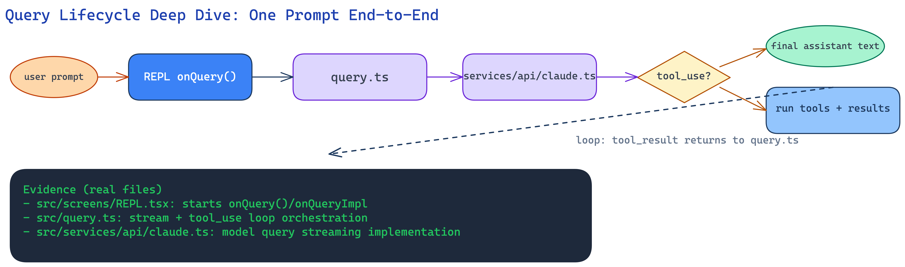

# Query Lifecycle Deep Dive

> **[Back to Learning Path](./README.md)** | **Prev:** [Startup & Bootstrap](./01-startup-bootstrap-deep-dive.md) | **Next:** [Tools, Permissions & MCP](./03-tools-permissions-mcp-deep-dive.md)

This page explains what happens after you submit one prompt -- from keystroke to final response.

---

## Table of contents

- [The fundamental idea](#the-fundamental-idea)
- [Visual diagram](#visual-diagram)
- [Step 1: Input enters the REPL pipeline](#step-1-input-enters-the-repl-pipeline)
- [Step 2: Query loop starts](#step-2-query-loop-starts)
- [Step 3: API streaming](#step-3-api-streaming)
- [Step 4: Tool turn](#step-4-tool-turn-if-the-model-requests-tools)
- [Step 5: Final answer and render](#step-5-final-answer-and-render)
- [Auto-compact: when context gets too large](#auto-compact-when-context-gets-too-large)
- [Mental model](#mental-model)
- [Key source files](#key-source-files)

---

## The fundamental idea

[`src/query.ts`](../../src/query.ts) is the **heart** of Claude Code.

It runs an async generator loop that:

1. Sends structured messages to the Claude API,
2. Streams the response (text, thinking, tool requests),
3. If tools are requested, executes them and appends results,
4. Continues the loop until the model produces a final answer.

Every interaction -- whether simple Q&A or a 50-step code refactor -- flows through this same loop.

---

## Visual diagram

This diagram shows one complete query cycle, including the tool feedback loop:

  

> Open the [Excalidraw source](./query-lifecycle-deep-dive.excalidraw) in [excalidraw.com](https://excalidraw.com) to explore interactively.

---

## Step 1: Input enters the REPL pipeline

**Files:** [`src/screens/REPL.tsx`](../../src/screens/REPL.tsx), [`src/utils/processUserInput/processUserInput.ts`](../../src/utils/processUserInput/processUserInput.ts)

When you press Enter in the REPL:

1. **Slash check** -- if input starts with `/`, route to slash command processing.
2. **Normal prompt** -- otherwise, wrap as a user message.
3. **Queue** -- [`messageQueueManager.ts`](../../src/utils/messageQueueManager.ts) queues the input. Slash commands are dequeued one at a time; normal prompts can batch.
4. **Dispatch** -- REPL calls `onQuery()` which triggers the query loop.

---

## Step 2: Query loop starts

**File:** [`src/query.ts`](../../src/query.ts)

The `query()` function receives:

| Parameter | What it is |
|-----------|-----------|
| `messages` | Full conversation history |
| `systemPrompt` | Rendered system prompt |
| `userContext` / `systemContext` | Extra context injected into the request |
| `canUseTool` | Callback that checks permissions |
| `toolUseContext` | Tools available + their definitions |
| `querySource` | Where this query originated (REPL, SDK, sub-agent) |

Before calling the API, the loop:
- normalizes messages for the wire format,
- checks token budget and decides if auto-compact is needed,
- attaches relevant memories and attachments,
- prepares streaming tool executor.

---

## Step 3: API streaming

**File:** [`src/services/api/claude.ts`](../../src/services/api/claude.ts)

The `queryModel()` function:

1. Builds the full API request (messages, tools, system prompt, model settings).
2. Calls the Anthropic Messages API with streaming enabled.
3. Yields events as they arrive:
   - **text deltas** -- streamed text content,
   - **thinking blocks** -- model's reasoning (when extended thinking is enabled),
   - **tool_use blocks** -- model wants to call a tool.

The streaming implementation handles retries, fallback models, prompt-too-long recovery, and max-output-tokens continuation.

---

## Step 4: Tool turn (if the model requests tools)

**Files:** [`src/services/tools/StreamingToolExecutor.ts`](../../src/services/tools/StreamingToolExecutor.ts), [`src/services/tools/toolOrchestration.ts`](../../src/services/tools/toolOrchestration.ts), [`src/services/tools/toolExecution.ts`](../../src/services/tools/toolExecution.ts)

When a `tool_use` block appears in the stream:

1. **`StreamingToolExecutor`** collects the tool use block as it streams in (input JSON may arrive in chunks).
2. **`runTools()`** in `toolOrchestration.ts` decides execution strategy:
   - concurrent-safe tools can run in parallel,
   - others run sequentially.
3. **`runToolUse()`** in `toolExecution.ts` handles a single tool:
   - validates input against the tool's Zod schema,
   - runs pre-tool-use hooks,
   - calls **`canUseTool()`** for permission decision,
   - executes the tool's `call()` method,
   - runs post-tool-use hooks,
   - formats the result as a `tool_result` message.
4. **Loop continues** -- the tool result is appended to messages, and `queryModel()` is called again.

This cycle can repeat many times in a single turn. A complex refactoring task might involve 20+ tool calls before the model produces its final answer.

---

## Step 5: Final answer and render

When the model finishes without requesting any tools:

1. **Terminal condition** -- the loop detects `stop_reason: "end_turn"` with no pending tool uses.
2. **Post-sampling hooks** -- any registered hooks run (e.g., stop hooks that can intercept the response).
3. **Yield final message** -- the assistant message is yielded from the generator.
4. **REPL renders** -- Ink components display the formatted response.
5. **Session storage** -- transcript is persisted via [`sessionStorage.ts`](../../src/utils/sessionStorage.ts).

---

## Auto-compact: when context gets too large

**Files:** [`src/services/compact/autoCompact.ts`](../../src/services/compact/autoCompact.ts), [`src/services/compact/compact.ts`](../../src/services/compact/compact.ts)

As conversations grow, context can exceed the model's window. Claude Code handles this with **auto-compact**:

1. Before each API call, `calculateTokenWarningState()` checks how full the context window is.
2. If tokens exceed a threshold, the system triggers compaction:
   - summarizes older messages,
   - replaces them with a compact summary,
   - preserves recent messages in full.
3. This happens transparently -- you don't see it, but the model gets a clean, focused context.

---

## Mental model

Think of the query lifecycle as a **conversation engine with pit stops**:

| Concept | Analogy |
|---------|---------|
| Query loop | A driver following a route |
| API call | Asking a navigator for directions |
| Tool execution | Pit stops -- refuel, change tires, check maps |
| Tool result | Pit stop report -- "tires changed, fuel full" |
| Final answer | Arriving at the destination |
| Auto-compact | Clearing the rearview mirrors -- keep looking forward |

The loop keeps driving until it reaches the destination (final answer). Each pit stop (tool call) gives the driver new information to work with.

---

## Key source files

| File | Role |
|------|------|
| [`src/screens/REPL.tsx`](../../src/screens/REPL.tsx) | Input handling, query dispatch, output rendering |
| [`src/query.ts`](../../src/query.ts) | Core agent loop -- streaming + tool execution cycle |
| [`src/services/api/claude.ts`](../../src/services/api/claude.ts) | Model API call, streaming, retries |
| [`src/services/tools/StreamingToolExecutor.ts`](../../src/services/tools/StreamingToolExecutor.ts) | Collects tool use blocks from stream |
| [`src/services/tools/toolOrchestration.ts`](../../src/services/tools/toolOrchestration.ts) | Parallel/sequential tool execution strategy |
| [`src/services/tools/toolExecution.ts`](../../src/services/tools/toolExecution.ts) | Single tool runner with hooks + telemetry |
| [`src/services/compact/autoCompact.ts`](../../src/services/compact/autoCompact.ts) | Auto-compaction trigger logic |
| [`src/utils/messageQueueManager.ts`](../../src/utils/messageQueueManager.ts) | Input queue management |

---

**Next:** [Tools, Permissions & MCP Deep Dive](./03-tools-permissions-mcp-deep-dive.md)
