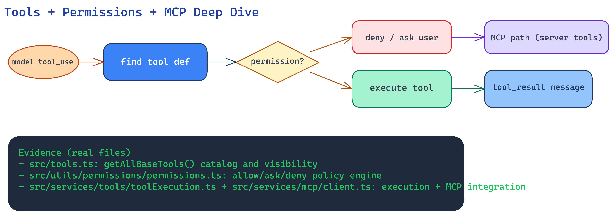

# Tools, Permissions, and MCP Deep Dive

This page explains how Claude Code safely executes tools and integrates MCP servers.

---

## Fundamental idea

Tool usage follows a strict path:

1. model asks for a tool (`tool_use`),
2. runtime finds tool definition,
3. permission engine decides allow/ask/deny,
4. approved tools execute,
5. results return to query loop,
6. model continues with new information.

MCP extends this system with external servers and resources.

---

## Component diagram (deeper view)

---

## Step-by-step walkthrough

### Step 1: Tool catalog and schemas

`src/tools.ts` builds base tool inventory through `getAllBaseTools()`.

This includes:
- file and shell tools,
- web/search tools,
- planning/task tools,
- MCP resource tools,
- feature-gated internal tools.

### Step 2: Permission decision

`src/utils/permissions/permissions.ts` evaluates rules:
- allow rules,
- deny rules,
- ask rules,
- mode/classifier/hook decisions.

Output is one of:
- allow,
- ask user,
- deny.

### Step 3: Tool execution

`src/services/tools/toolExecution.ts` runs the selected tool with:
- execution spans/telemetry,
- hook lifecycle,
- error shaping,
- normalized tool result messages.

### Step 4: MCP integration path

`src/services/mcp/client.ts` manages external MCP servers:
- connections/transports,
- listed tools/resources,
- MCP auth and session handling,
- remote tool calls and resource reads.

In simple terms, MCP makes external systems look like local tools.

---

## Mental model

Think of tools as a factory line with a security checkpoint:

- **catalog desk** (`tools.ts`) says what machines exist,
- **security gate** (`permissions.ts`) decides if machine can run now,
- **machine room** (`toolExecution.ts`) performs the work,
- **external branch** (`mcp/client.ts`) runs compatible machines in remote factories.

---

## Key source files

- `src/tools.ts`
- `src/utils/permissions/permissions.ts`
- `src/services/tools/toolExecution.ts`
- `src/services/tools/toolOrchestration.ts`
- `src/services/mcp/client.ts`
- `src/utils/slashCommandParsing.ts`
