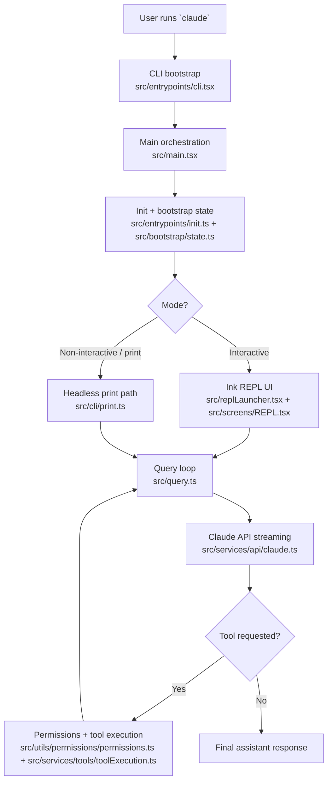
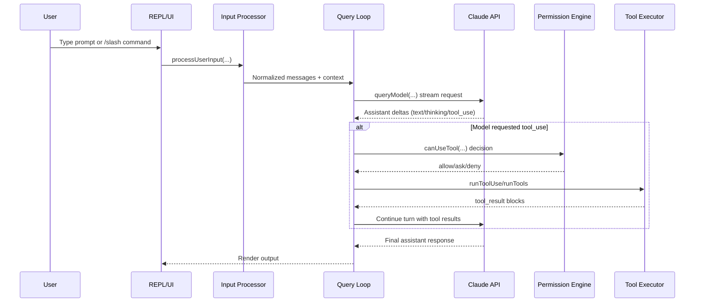
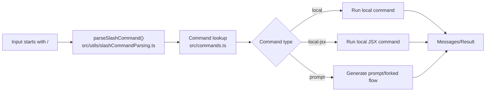
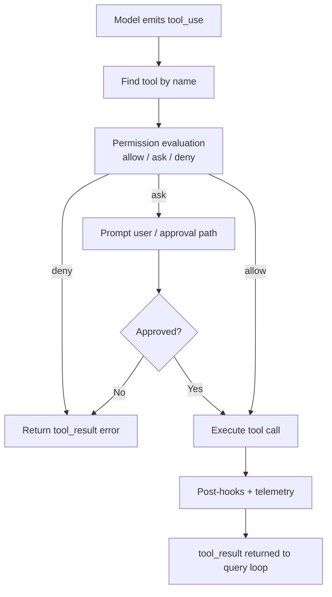

# Claude Code Source Architecture (Easy Guide)

This guide explains how this codebase works in simple terms.

The short version:
- `claude` starts in a lightweight CLI bootstrap.
- The app initializes config, auth, state, and integrations.
- It launches either an interactive REPL UI (Ink) or a non-interactive print mode.
- User input is parsed (normal prompt or slash command), then sent through the query loop.
- The model may request tools; tools are permission-checked, executed, and results are fed back.
- The loop continues until the assistant reaches a final response.

---

## 1) Big Picture

Think of the system as 6 layers:

1. **Entrypoint layer**: starts fast and routes to the right runtime path.
2. **Bootstrap layer**: loads settings, policies, telemetry, auth, and environment.
3. **Interaction layer**: REPL UI and input handling.
4. **Agent loop layer**: message/query loop with streaming model responses.
5. **Tool layer**: built-in tools, MCP tools, permission gating, execution.
6. **State + observability layer**: session state, transcripts, analytics, telemetry.

---

## 2) Startup Fundamentals

### Step A: Fast bootstrap

`src/entrypoints/cli.tsx` is intentionally small and fast:
- handles quick paths like `--version`,
- handles feature-gated special modes,
- then imports and hands off to `main()`.

This design avoids loading the full app for cheap commands.

### Step B: Main orchestration

`src/main.tsx` is the orchestrator:
- parses CLI options and determines interactive vs non-interactive mode,
- initializes environment and services (`init`),
- sets process/session-level state in `bootstrap/state.ts`,
- loads tools, commands, MCP resources, plugins, and skills,
- launches REPL (interactive) or print/headless flow.

### Step C: Global init and trust-sensitive setup

`src/entrypoints/init.ts` performs global setup (config, safe env, cleanup, telemetry plumbing).

In simple terms: **startup is split into "fast route" and "full setup"** so the app can be both responsive and feature-rich.

---

## 3) Input to Output Lifecycle

This is the core "how Claude Code works" loop.

Key files in this path:
- UI entry: `src/replLauncher.tsx`, `src/screens/REPL.tsx`
- Input handling: `src/utils/processUserInput/processUserInput.ts`, `src/utils/processUserInput/processSlashCommand.tsx`
- Command parsing: `src/utils/slashCommandParsing.ts`
- Core loop: `src/query.ts`
- API call path: `src/services/api/claude.ts`

---

## 4) Slash Commands (Simple Mental Model)

Slash commands are not magic. They follow a clean pipeline:

1. detect `/...` input,
2. parse command name + args (`parseSlashCommand`),
3. resolve command from registry (`commands.ts`),
4. dispatch by command type:
   - local,
   - local-jsx,
   - prompt/fork.

---

## 5) Tools, Permissions, and Safety

### Tool registration

`src/tools.ts` defines the tool catalog (`getAllBaseTools()`):
- file tools (`ReadFile`, `FileEdit`, `Glob`, etc.),
- shell tools (`Bash`, `PowerShell`),
- web tools (`WebFetch`, `WebSearch`),
- planning/task tools,
- MCP resource/tools bridge,
- many feature-gated tools.

### Permission decisions

Before a tool runs, permission logic evaluates:
- allow rules,
- deny rules,
- ask rules,
- mode/classifier/hook constraints.

This logic lives in `src/utils/permissions/permissions.ts`.

### Execution

If approved, execution flows through `src/services/tools/toolExecution.ts` (with hooks and telemetry), and orchestration helpers under `src/services/tools/toolOrchestration.ts`.

---

## 6) MCP Integration (Model Context Protocol)

`src/services/mcp/client.ts` manages MCP servers and connections:
- transport types (stdio/SSE/streamable HTTP/websocket),
- listing MCP tools/resources,
- MCP tool call execution + error handling,
- auth flows (including MCP auth tool),
- resource reads and result handling.

Beginner mental model:
- MCP lets Claude Code treat external systems as tools/resources.
- The MCP client converts remote capabilities into local "tool-like" interfaces.

---

## 7) State and Observability Fundamentals

### State
- `src/bootstrap/state.ts`: process/session-wide runtime state.
- `src/state/*`: app/repl state store and transitions.
- `src/utils/sessionStorage.ts`: transcript/session persistence helpers.

### Observability
- `src/services/analytics/index.ts`: product analytics events.
- `src/utils/telemetry/*`: tracing and telemetry internals.

Practical meaning: the app can recover context, track behavior, and debug performance over long sessions.

---

## 8) "One Prompt" Walkthrough (In Plain Words)

When you type one request:
1. UI receives text.
2. Parser checks if it is slash command or normal message.
3. Query loop sends structured messages to the model API.
4. Model streams output.
5. If model needs tools, permission engine decides and tool executor runs approved tools.
6. Tool results are added back to the conversation.
7. Model continues and returns final answer.
8. REPL renders final response and stores session artifacts.

---

## 9) Most Important Files to Read First

If you want to learn this codebase quickly, read in this order:

1. `src/entrypoints/cli.tsx`
2. `src/main.tsx`
3. `src/entrypoints/init.ts`
4. `src/replLauncher.tsx`
5. `src/screens/REPL.tsx`
6. `src/query.ts`
7. `src/services/api/claude.ts`
8. `src/tools.ts`
9. `src/services/tools/toolExecution.ts`
10. `src/utils/permissions/permissions.ts`
11. `src/services/mcp/client.ts`
12. `src/commands.ts`

---

## 10) Why This Architecture Works

In simple terms, this architecture separates concerns clearly:
- startup is optimized for speed,
- UI loop is independent from model API details,
- tool system is modular and permission-gated,
- external integrations (MCP/plugins/skills) are pluggable,
- state and telemetry are centralized.

That separation makes a very complex agent system maintainable in practice.
