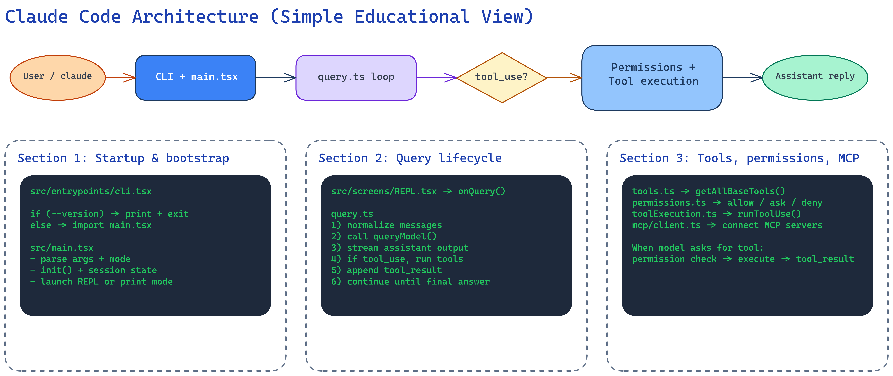
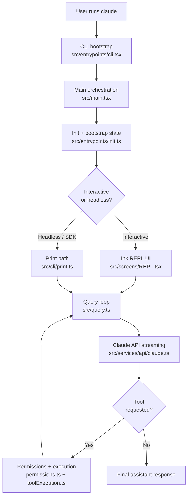
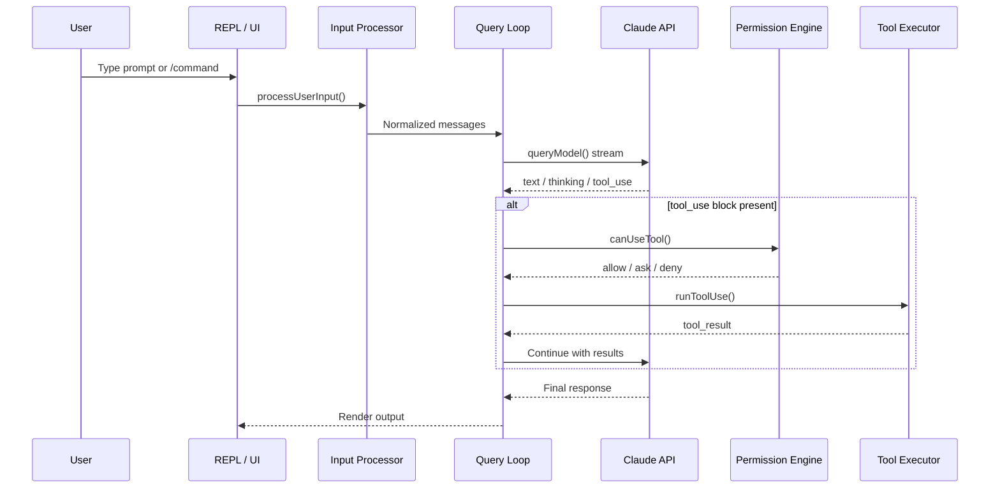
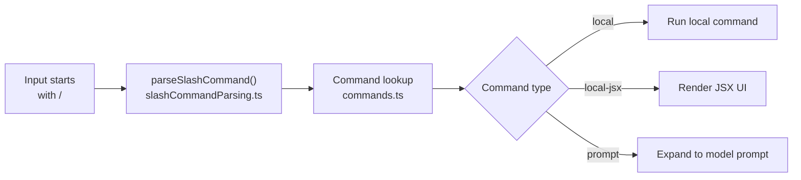
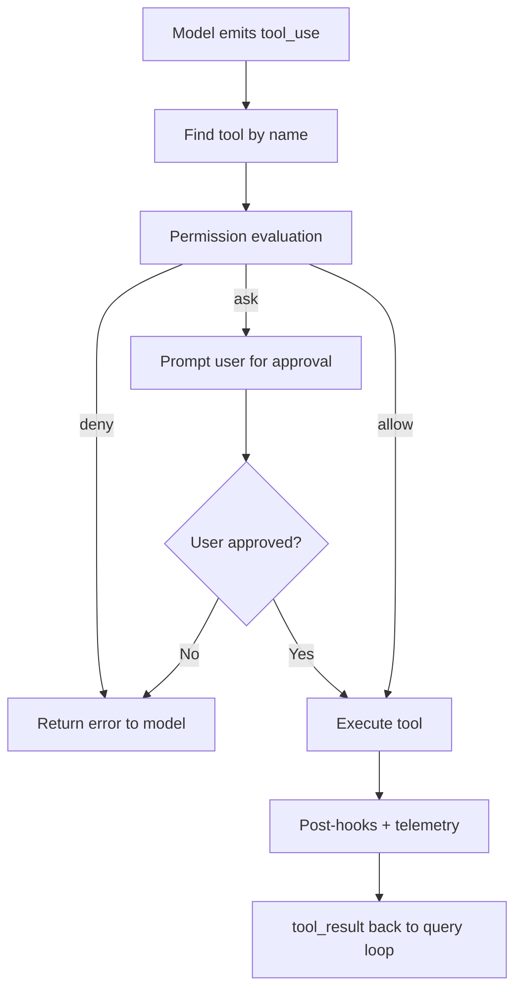

# Claude Code Architecture Overview

> **[Back to Learning Path](./README.md)** | **Next:** [Startup & Bootstrap Deep Dive](./01-startup-bootstrap-deep-dive.md)

This page gives you the complete big picture of how Claude Code works -- in simple terms.
By the end, you will understand every layer from typing `claude` to seeing a response.

---

## Table of contents

- [The 30-second summary](#the-30-second-summary)
- [The 6 layers](#the-6-layers)
- [End-to-end flow diagram](#end-to-end-flow-diagram)
- [Startup fundamentals](#startup-fundamentals)
- [Input to output lifecycle](#input-to-output-lifecycle)
- [Slash commands](#slash-commands)
- [Tools, permissions, and safety](#tools-permissions-and-safety)
- [MCP integration](#mcp-integration)
- [State and observability](#state-and-observability)
- [One prompt walkthrough](#one-prompt-walkthrough-in-plain-words)
- [Top 12 files to read first](#top-12-files-to-read-first)

---

## The 30-second summary

  

1. You run `claude` in your terminal.
2. A thin bootstrap checks for fast-path flags, then loads the full app.
3. The app initializes config, auth, state, and integrations.
4. It launches either an **interactive REPL** (terminal UI) or a **headless print** mode.
5. Your input is parsed -- normal prompt or slash command -- then sent through the **query loop**.
6. The model streams a response. If it needs a tool, the **permission engine** decides, the **tool executor** runs it, and results feed back into the loop.
7. This continues until the model produces a final answer.

---

## The 6 layers

Think of Claude Code as 6 stacked layers. Each layer has a clear job:

| # | Layer | What it does | Key files |
|---|-------|-------------|-----------|
| 1 | **Entrypoint** | Starts fast, routes to the right runtime path | [`src/entrypoints/cli.tsx`](../../src/entrypoints/cli.tsx) |
| 2 | **Bootstrap** | Loads settings, policies, telemetry, auth, environment | [`src/main.tsx`](../../src/main.tsx), [`src/entrypoints/init.ts`](../../src/entrypoints/init.ts) |
| 3 | **Interaction** | REPL terminal UI and input handling | [`src/screens/REPL.tsx`](../../src/screens/REPL.tsx) |
| 4 | **Agent loop** | Message/query loop with streaming model responses | [`src/query.ts`](../../src/query.ts) |
| 5 | **Tools** | Built-in tools, MCP tools, permission gating, execution | [`src/tools.ts`](../../src/tools.ts), [`src/services/tools/`](../../src/services/tools/) |
| 6 | **State + Observability** | Session state, transcripts, analytics, telemetry | [`src/bootstrap/state.ts`](../../src/bootstrap/state.ts) |

---

## End-to-end flow diagram

---

## Startup fundamentals

> **Deep dive:** [Startup & Bootstrap Deep Dive](./01-startup-bootstrap-deep-dive.md)

Startup is split into two phases so cheap commands (like `claude --version`) don't pay the full cost of loading everything.

### Phase 1 -- Fast gate

[`src/entrypoints/cli.tsx`](../../src/entrypoints/cli.tsx) runs first. It handles:
- `--version` (prints version, exits immediately),
- feature-gated fast paths (bridge, daemon, background sessions),
- then lazily imports `main.tsx`.

### Phase 2 -- Full runtime

[`src/main.tsx`](../../src/main.tsx) is the orchestrator:
- parses CLI options,
- runs [`init()`](../../src/entrypoints/init.ts) for environment setup,
- sets session state in [`bootstrap/state.ts`](../../src/bootstrap/state.ts),
- loads tools, commands, MCP servers, plugins, and skills,
- launches either REPL or headless path.

**Why it matters:** this two-phase design means `claude --version` takes ~50ms, while a full interactive session gets all features loaded in parallel.

---

## Input to output lifecycle

> **Deep dive:** [Query Lifecycle Deep Dive](./02-query-lifecycle-deep-dive.md)

This is the core "how Claude Code works" loop:

**Key files in this path:**

| Stage | File |
|-------|------|
| UI entry | [`src/replLauncher.tsx`](../../src/replLauncher.tsx), [`src/screens/REPL.tsx`](../../src/screens/REPL.tsx) |
| Input parsing | [`src/utils/processUserInput/processUserInput.ts`](../../src/utils/processUserInput/processUserInput.ts) |
| Slash command parsing | [`src/utils/slashCommandParsing.ts`](../../src/utils/slashCommandParsing.ts) |
| Core loop | [`src/query.ts`](../../src/query.ts) |
| API streaming | [`src/services/api/claude.ts`](../../src/services/api/claude.ts) |

---

## Slash commands

Slash commands are not magic. They follow a clean 3-step pipeline:

1. **Parse** -- [`parseSlashCommand()`](../../src/utils/slashCommandParsing.ts) extracts name + args.
2. **Lookup** -- [`commands.ts`](../../src/commands.ts) resolves the name against the merged command registry (built-in + plugins + skills).
3. **Dispatch** -- depending on the command type:
   - **`local`**: runs synchronously, returns text (e.g. `/clear`)
   - **`local-jsx`**: renders an Ink UI component (e.g. `/config`)
   - **`prompt`**: generates context for the model, optionally in a forked sub-agent (e.g. `/review`)

---

## Tools, permissions, and safety

> **Deep dive:** [Tools, Permissions & MCP Deep Dive](./03-tools-permissions-mcp-deep-dive.md)

### Tool catalog

[`src/tools.ts`](../../src/tools.ts) defines the full tool inventory via `getAllBaseTools()`:

| Category | Examples |
|----------|----------|
| File tools | `FileRead`, `FileEdit`, `FileWrite`, `Glob`, `Grep` |
| Shell tools | `Bash`, `PowerShell` |
| Web tools | `WebFetch`, `WebSearch` |
| Planning tools | `TodoWrite`, `EnterPlanMode`, `ExitPlanMode` |
| Agent tools | `AgentTool` (sub-agents), `SkillTool` |
| MCP bridge | `MCPTool`, `ListMcpResources`, `ReadMcpResource` |
| Task tools | `TaskCreate`, `TaskUpdate`, `TaskList`, `TaskStop` |

### Permission flow

Permission rules come from multiple sources -- CLI args, user settings, project settings, policy settings, and session grants -- all evaluated in [`permissions.ts`](../../src/utils/permissions/permissions.ts).

---

## MCP integration

[MCP (Model Context Protocol)](https://modelcontextprotocol.io/) lets Claude Code talk to external servers as if they were local tools.

[`src/services/mcp/client.ts`](../../src/services/mcp/client.ts) handles:
- connecting via stdio, SSE, streamable HTTP, or WebSocket transports,
- discovering tools and resources from each server,
- executing tool calls with auth, timeout, and error handling,
- resource reads and binary content persistence.

**Simple mental model:** MCP turns remote APIs into tool-shaped interfaces that the model can call just like built-in tools.

---

## State and observability

### State management

| What | Where |
|------|-------|
| Process-wide session state | [`src/bootstrap/state.ts`](../../src/bootstrap/state.ts) |
| REPL UI state | [`src/state/AppStateStore.ts`](../../src/state/AppStateStore.ts), [`src/state/store.ts`](../../src/state/store.ts) |
| Session persistence | [`src/utils/sessionStorage.ts`](../../src/utils/sessionStorage.ts) |

### Observability

| What | Where |
|------|-------|
| Product analytics | [`src/services/analytics/index.ts`](../../src/services/analytics/index.ts) |
| OTel-style tracing | [`src/utils/telemetry/sessionTracing.ts`](../../src/utils/telemetry/sessionTracing.ts) |
| Perfetto traces | [`src/utils/telemetry/perfettoTracing.ts`](../../src/utils/telemetry/perfettoTracing.ts) |

---

## One prompt walkthrough (in plain words)

When you type one request, here is exactly what happens:

1. **REPL** receives your text.
2. **Input processor** checks: is this a `/slash command` or a normal message?
3. **Query loop** packages messages + system prompt + tool schemas and sends to the API.
4. **API** streams back: text chunks, thinking blocks, and/or `tool_use` blocks.
5. If `tool_use`: **permission engine** evaluates rules, **tool executor** runs the approved tool, result is added to conversation.
6. **Loop repeats** (steps 3-5) until no more tool calls.
7. **Final response** is rendered in the REPL.
8. **Session storage** persists transcript artifacts.

---

## Top 12 files to read first

If you want to learn this codebase quickly, read in this order:

| # | File | Why |
|---|------|-----|
| 1 | [`src/entrypoints/cli.tsx`](../../src/entrypoints/cli.tsx) | Entry point -- fast path routing |
| 2 | [`src/main.tsx`](../../src/main.tsx) | Full orchestrator -- args, init, mode |
| 3 | [`src/entrypoints/init.ts`](../../src/entrypoints/init.ts) | Environment and service setup |
| 4 | [`src/replLauncher.tsx`](../../src/replLauncher.tsx) | How Ink REPL gets mounted |
| 5 | [`src/screens/REPL.tsx`](../../src/screens/REPL.tsx) | Interactive surface and query dispatch |
| 6 | [`src/query.ts`](../../src/query.ts) | The agent loop -- streaming + tool execution |
| 7 | [`src/services/api/claude.ts`](../../src/services/api/claude.ts) | Model API call implementation |
| 8 | [`src/tools.ts`](../../src/tools.ts) | Tool catalog registration |
| 9 | [`src/services/tools/toolExecution.ts`](../../src/services/tools/toolExecution.ts) | Individual tool runner |
| 10 | [`src/utils/permissions/permissions.ts`](../../src/utils/permissions/permissions.ts) | Permission allow/ask/deny engine |
| 11 | [`src/services/mcp/client.ts`](../../src/services/mcp/client.ts) | MCP server integration |
| 12 | [`src/commands.ts`](../../src/commands.ts) | Slash command registry |

---

## Why this architecture works

This design separates concerns cleanly:

- **Startup is fast** -- cheap commands exit in milliseconds.
- **UI is decoupled from model logic** -- REPL and headless share the same query loop.
- **Tools are modular and gated** -- each tool has a schema, permission rules, and execution hooks.
- **External integrations are pluggable** -- MCP, plugins, and skills all load through the same interfaces.
- **State and telemetry are centralized** -- one place to debug, recover, or analyze sessions.

That separation is what makes a 1900-file agent system maintainable.

---

**Next:** [Startup & Bootstrap Deep Dive](./01-startup-bootstrap-deep-dive.md)
